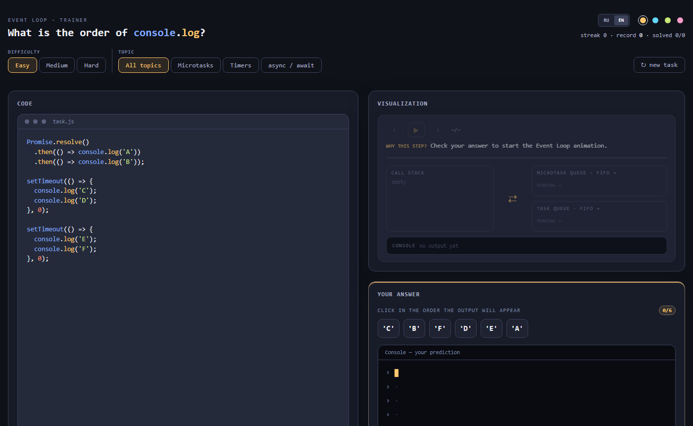

# Event Loop Trainer ⟳

[](https://github.com/nprvsh/EventLoopTrainer/actions/workflows/ci.yml)
[](https://github.com/nprvsh/EventLoopTrainer/actions/workflows/deploy.yml)

**[eventloop.lol](https://eventloop.lol/en/)** · [Русская версия](#русская-версия)

An interactive JavaScript Event Loop trainer. Predict the order of `console.log` output and learn how synchronous code, microtasks, and macrotasks move through the queues.



## Features

- Randomly generates unique exercises from ready-made code blocks: synchronous code, `setTimeout`, `Promise.then`, `Promise.finally`, `async/await`, and `queueMicrotask`.
- Assemble your prediction from shuffled output values, fix it before checking, and see mistakes immediately.
- Step-by-step Event Loop visualization: Call Stack, microtask queue, timer queue, and console — each step highlights the matching line of code and explains the transition.
- Textual breakdown of the execution order after every check.
- Themed practice: microtasks, timers, or `async/await`.
- Tracks your streak, record, solved count, and recent mistakes locally in the browser.

The reference answer is determined by actually executing the generated snippet with an intercepted `console.log` — not by a hardcoded solution.

## Difficulty levels

| Level | Contents |
| --- | --- |
| **Easy** | Synchronous code, timers, and simple microtasks. Every task is guaranteed to mix micro- and macrotasks. |
| **Medium** | `async/await`, nested callbacks, promise chains, and trickier queue combinations. |
| **Hard** | Heavy combinations of nested timers, microtasks, and `async/await`; up to 16 output lines. |

## How to use

1. Pick a level and a topic, or generate a new task.
2. Read the code and click the values in the order you expect them to print.
3. Press "Check", then open the explanation or the Event Loop animation; failed tasks can be retried from the mistakes list.

## Development

Requires Node.js 22+. Stack: React 18, TypeScript, Vite 5, CSS Modules, ESLint 9, Vitest, Husky.

```bash
npm install
npm run dev          # dev server (http://localhost:5173)
npm test             # unit tests (Vitest)
npm run check-types  # tsc --noEmit
npm run lint         # ESLint
npm run build        # production build of both pages (/ and /en/) into dist/
npm run preview      # serve the production build
```

Husky runs `check-types` and `lint` before every commit; the CI workflow additionally runs tests and the build on every push and pull request.

### Project structure

```text
├── .github/workflows/
│   ├── ci.yml                    # type check, lint, tests, build on PRs and pushes
│   └── deploy.yml                # GitHub Pages: build and deploy from main
├── en/index.html                 # prerendered English page (second Vite entry)
├── index.html                    # prerendered Russian page
├── src/
│   ├── main.tsx                  # React entry point
│   ├── App.tsx                   # layout and presentation state
│   ├── hooks/                    # task lifecycle, persistence, theming, locale/SEO
│   ├── components/               # trainer UI and CSS modules
│   │   ├── EventLoopViz/         # step-by-step queue visualization
│   │   ├── TaskCodePanel/        # code display and highlighting
│   │   ├── TokenPicker/          # picking the output order
│   │   ├── AnswerConsole/        # prediction and check results
│   │   └── TaskExplanation/      # textual breakdown
│   ├── data/
│   │   ├── blocks/               # snippet building blocks (code + log metadata)
│   │   ├── levels/               # difficulty settings
│   │   └── phases/               # phase names and hints
│   ├── lib/
│   │   ├── generator/            # assembles snippets and executes them for real
│   │   ├── sim/                  # frames for the Event Loop animation
│   │   └── random/               # random pick and shuffle
│   ├── styles/                   # global styles and shared controls
│   └── types/                    # shared TypeScript types
├── vite.config.ts                # two entries + build-time FAQ JSON-LD injection
└── vitest.config.ts
```

### How it works

- [`src/data/blocks`](src/data/blocks/index.ts) — code-block generators; each returns lines of code plus log metadata (phase, parent callback).
- [`src/lib/generator`](src/lib/generator/index.ts) — assembles blocks into a snippet, then **executes it for real** with an intercepted `console.log` to obtain the reference order.
- [`src/lib/sim`](src/lib/sim/index.ts) — builds visualization frames (stack / queues / console) from the log metadata and the actual output order.

The site is prerendered in two languages (`/` — Russian, `/en/` — English) as two Vite entry points sharing one bundle.

## Deployment

A GitHub Actions workflow builds the project on every push to `main` and publishes `dist/` to GitHub Pages at [eventloop.lol](https://eventloop.lol/).

## License

[GPL-3.0](LICENSE)

---

## Русская версия

Интерактивный тренажёр по JavaScript Event Loop. Соберите порядок, в котором появятся вызовы `console.log`, и разберите, как синхронный код, микрозадачи и макрозадачи попадают в очереди.

### Возможности

- Случайно генерирует уникальные задачи из готовых блоков кода: синхронный код, `setTimeout`, `Promise.then`, `Promise.finally`, `async/await` и `queueMicrotask`.
- Позволяет собрать прогноз из перемешанных значений вывода, исправить его до проверки и сразу увидеть ошибки.
- Визуализирует Event Loop по шагам: Call Stack, очередь микрозадач, очередь таймеров и консоль. На каждом шаге подсвечивается соответствующая строка кода и объясняется причина перехода.
- После проверки показывает текстовый разбор порядка выполнения.
- Тематические тренировки: микрозадачи, таймеры или `async/await`.
- Сохраняет статистику серии, рекорда, решённых задач и последние ошибки в браузере.

Эталонный порядок определяется фактическим выполнением сгенерированного сниппета с перехваченным `console.log`, а не заранее заданным ответом.

### Уровни сложности

| Уровень | Содержимое |
| --- | --- |
| **Easy** | Синхронный код, таймеры и простые микрозадачи. В задаче гарантированно есть и микро-, и макрозадача. |
| **Medium** | `async/await`, вложенные колбэки, цепочки промисов и более сложные сочетания очередей. |
| **Hard** | Объёмные комбинации вложенных таймеров, микрозадач и `async/await`; до 16 строк вывода. |

### Как пользоваться

1. Выберите уровень, тему или создайте новую задачу.
2. Прочитайте код и нажимайте на значения в порядке ожидаемого вывода.
3. Нажмите «Проверить», затем откройте «разбор» или «анимацию event loop»; при ошибке задачу можно повторить кнопкой «ошибки».

Документация для разработчиков — в секции [Development](#development) выше.
